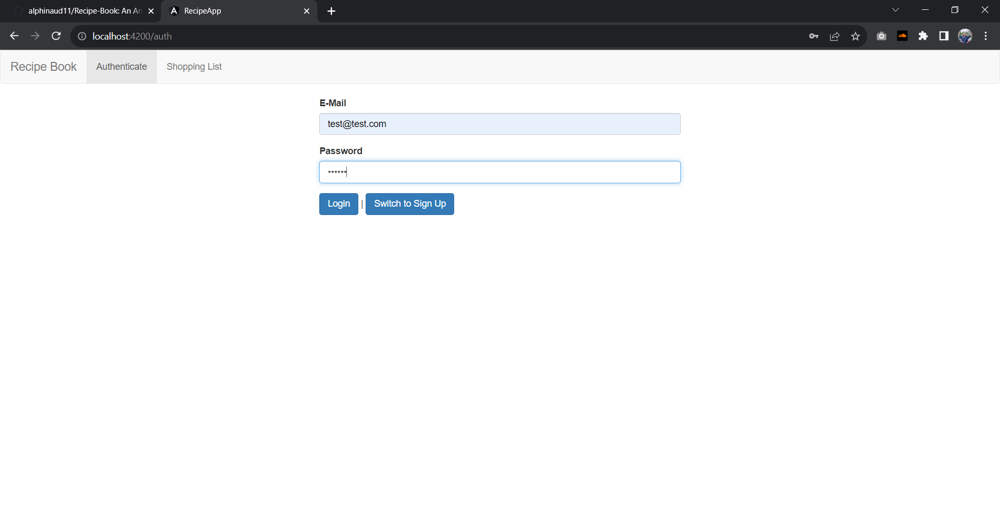
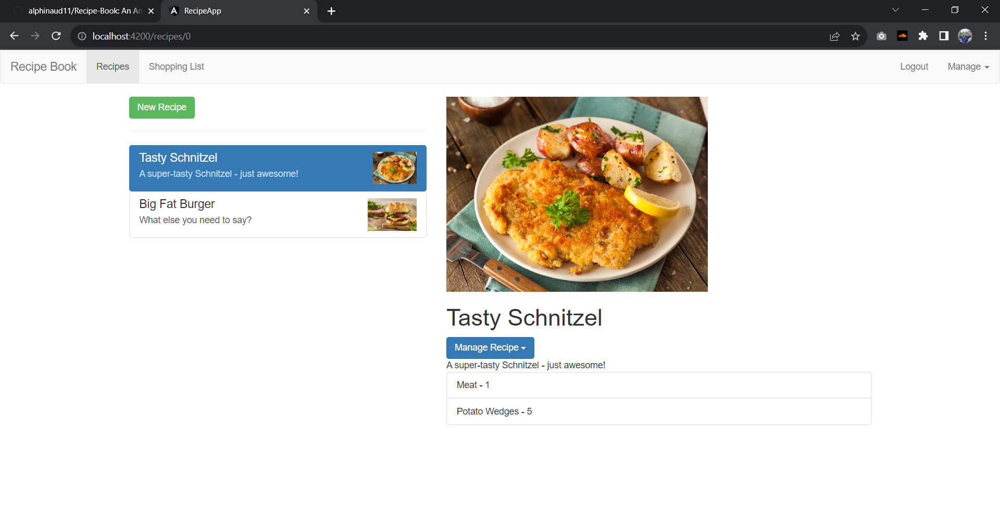
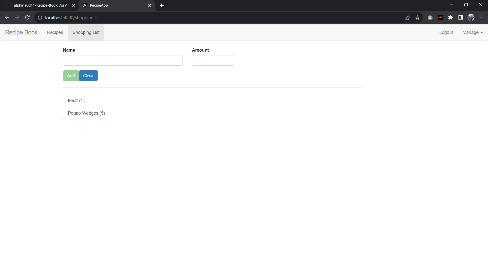

# Recipe Book

An Angular application developed as a project for Udemy's course **"Angular - The Complete Guide (2023 Edition)"** which is taught by Maximilian Schwarzmüller.

***Work Still in Progress!***.

**Authentication Page**

**Recipes Page**

**Shopping List Page**

## Development Server

Run `ng serve` for a dev server. Navigate to `http://localhost:4200/`. The application will automatically reload if you change any of the source files.

## Firebase

This project uses Firebase for authentication and database. To integrate with Firebase, update the [environment.development](src/environments/environment.development.ts) file to include your Firebase project's URLs and API key.

**Note**: add '/recipes.json' at the end of your realtime database url.
